# 📱 Fake Store e-commerce 

## 📝 Table of Contents

- [About](#about)
- [Features](#features)
- [Screenshots](#screenshots)
- [Installation](#installation)
- [Usage](#usage)
- [Architecture](#architecture)
- [Technologies Used](#technologies-used)
- [Contributing](#contributing)
- [License](#license)
- [Contact](#contact)

---

## 📖 About

**Fake Store** is a cross-platform e-commerce app designed for seamless shopping across multiple devices.  

- Browse a wide range of products categorized for easy navigation.  
- Log in using usernames available in the [Fake Store API](https://fakestoreapi.com/).  
- Add products to your **favorites list** and **shopping cart** for quick access.  
- Enjoy an intuitive user interface that enhances your shopping experience.  

Whether you're exploring new products or managing your shopping list, **Fake Store** offers a smooth and efficient way to shop online.  

## 🚀 Features  

Explore the main features of **Fake Store**:  
- ✅ **Seamless Navigation** between screens like [Products](#ProductScreen), [Home](#HomeScreen), [Cart](#CartScreen), [User](#UserScreen), and [Login](#LoginScreen).  
- ✅ Add products to your **personal shopping list**, track selected items, and calculate the total amount to pay.  
- ✅ Save favorite items in a **wishlist** for quick access later.  
- ✅ Adjust product quantity before purchasing—increase or decrease as needed.  
- ✅ Log in to retrieve and manage user information.  
- ✅ **Search** for products by name to find exactly what you need.  
- ✅ **Filter** products by category for a more convenient shopping experience.  
- ✅ **Adaptive Design** for different screen widths, ensuring a seamless experience on mobile, tablet, and desktop devices.  
- ✅ **Company Information** section to display details like location, company name, and social networks.   

## 📸 Screenshots

Provide screenshots or GIFs of your app:

| Unauthenticated Home Screen | Product Screen | Login |
|-------------|----------------|----------|
| 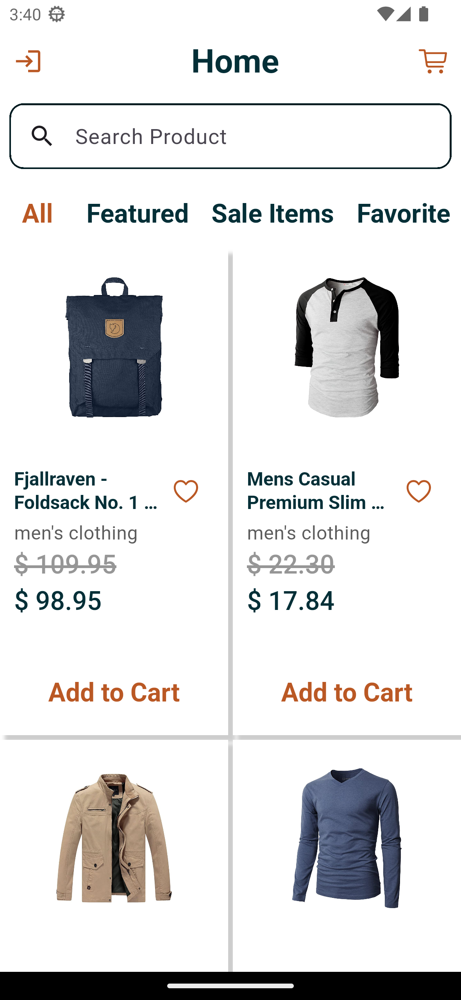 | 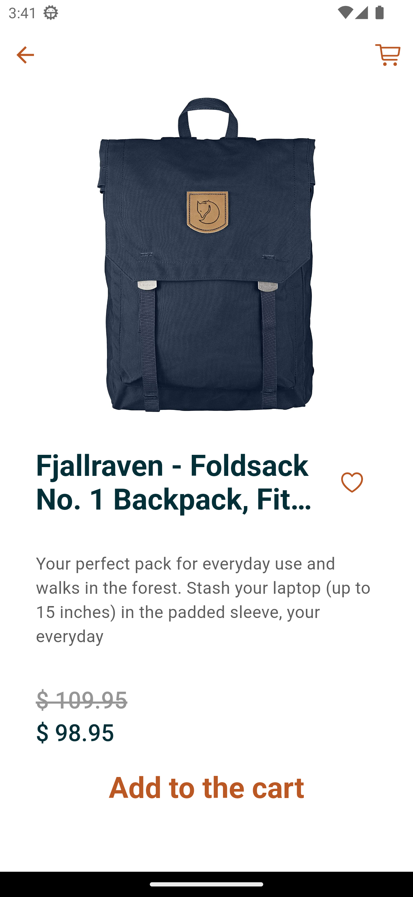 | 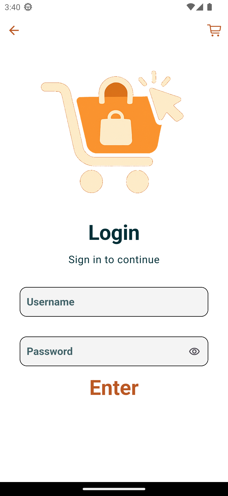 |

| Authenticated Home Screen | User Screen | Company Info |
|-------------|----------------|----------|
| 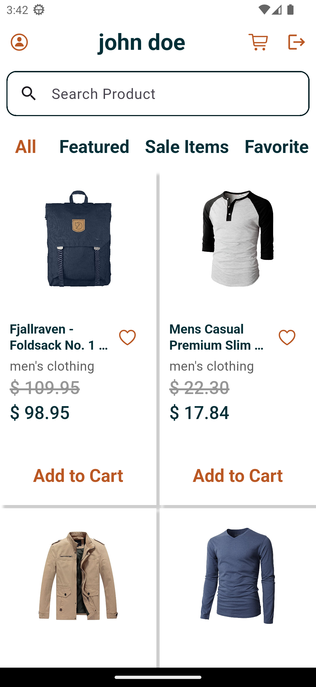 | 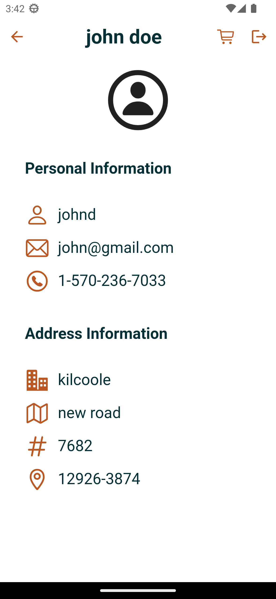 | 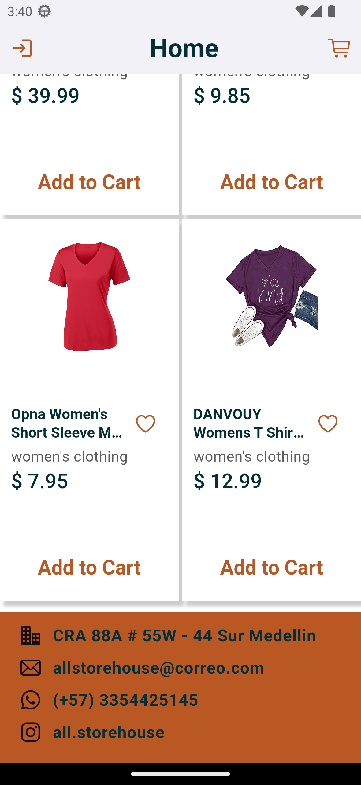 |

| Authenticated Cart Screen | Unauthenticated Cart Screen | Authenticated Verification |
|-------------|----------------|----------|
| 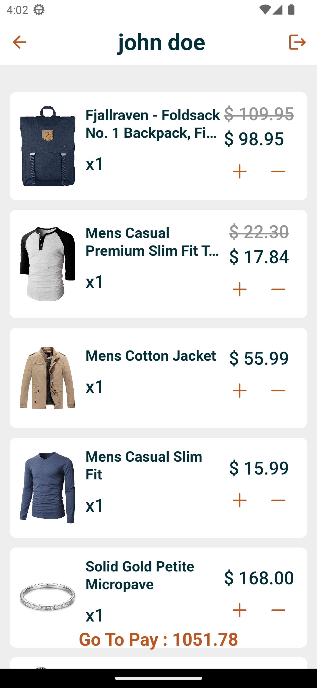 | 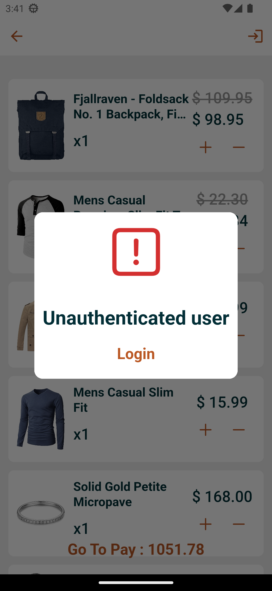 | 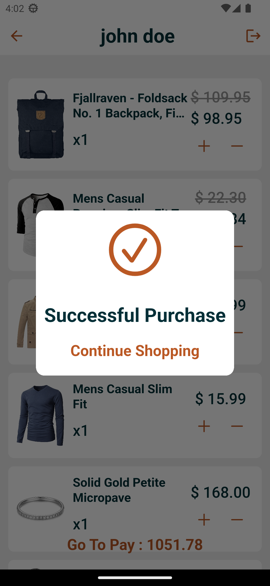 |

## 🔧 Installation

### Prerequisites

- Flutter SDK
- Dart SDK

### Setup

```bash
    git clone https://github.com/Maullin1996/e_commerce_fake_store.git
    git clone https://github.com/Maullin1996/fake_store_api_package.git (ApiPackage)
    git clone https://github.com/Maullin1996/fake_store_design.git (AtomicDesing)

    cd fake_store
    flutter pub get
    flutter run
```

## 💡 Usage

| Navigation | Login |
|-------------|----------------|
|  | 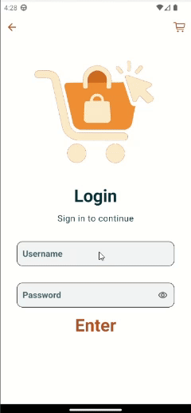 |

| Add to the Cart | Add to Favorite |
|-------------|----------------|
|  | 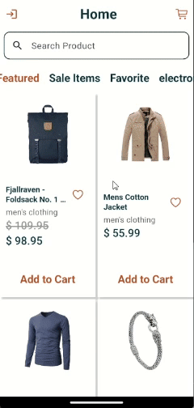 |

## 🧱 Architecture

This project follows a modular and scalable architecture inspired by Domain-Driven Design (DDD), separating business logic, infrastructure, and presentation layers.
```bash
lib/
├── config/                # Configuration, routing, and mock utilities
│   ├── mock/              # Fake/mock data sources for development
│   └── router/            # App routing configuration
│
├── domain/               # Core business logic (independent of Flutter)
│   ├── models/           # Pure data models (Entities/Value Objects)
│   ├── services/         # Abstract service contracts (interfaces)
│   └── models.dart       # Aggregate export
│
├── infrastructure/       # Implementation details (Mappers y local storage)
│   ├── helpers/          # Utilities and shared helpers
│   └── services/         # Concrete implementations of domain services
│
├── presentation/         # UI layer (Flutter-specific)
│   ├── helpers/          # UI-specific utilities
│   ├── pages/            # UI pages/screens
│   ├── providers/        # State management using Riverpod
│   └── pages.dart        # Export for routing
│
├── main.dart             # Entry point of the app
└── my_app.dart           # App widget tree and theme initialization
```

## 🛠 Technologies Used
This app is built using Flutter and follows best practices for clean architecture and state management.

### 🧩 Core Dependencies
| Package                                                             | Description                                                                |
| ------------------------------------------------------------------- | -------------------------------------------------------------------------- |
| [`flutter_riverpod`](https://pub.dev/packages/flutter_riverpod)     | State management solution used for scalable and reactive UI.               |
| [`go_router`](https://pub.dev/packages/go_router)                   | Declarative routing for managing navigation across the app.                |
| [`shared_preferences`](https://pub.dev/packages/shared_preferences) | For storing simple local data like auth tokens or user preferences.        |
| [`dartz`](https://pub.dev/packages/dartz)                           | Functional programming tools like `Either`, used for clean error handling. |
| [`collection`](https://pub.dev/packages/collection)                 | Utility functions and enhanced collection operations.                      |
| [`cupertino_icons`](https://pub.dev/packages/cupertino_icons)       | Icon pack for iOS-styled apps.                                             |

### 📦 Custom Packages
| Package                                                                           | Description                                                     |
| --------------------------------------------------------------------------------- | --------------------------------------------------------------- |
| [`fake_store_api_package`](https://github.com/Maullin1996/fake_store_api_package) | Custom Dart package for interacting with the Fake Store API.    |
| [`fake_store_design`](https://github.com/Maullin1996/fake_store_design)           | Shared UI components and design system used throughout the app. |


## 🤝 Contributing
Pull requests are welcome! For major changes, please open an issue first to discuss what you would like to change.